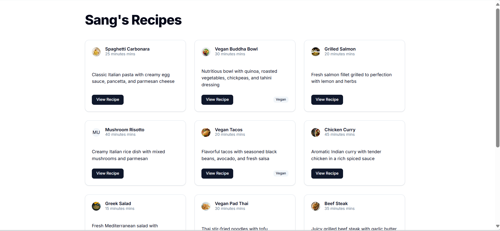

# Study basic Next.js + Shadcn

A simple learning project built with **Next.js** and **Shadcn UI** — used for exploring the basics of Next.js framework, Shadcn component system, and deployment workflow using **Vercel**.

---

## 🚀 Tech Stack

- **Next.js 15** – React framework for full-stack web apps  
- **Shadcn/UI** – Beautiful, accessible UI components  
- **TypeScript** – For type safety  
- **Tailwind CSS** – Utility-first styling  
- **Vercel** – Hosting and automatic CI/CD

---

## 📦 Getting Started (Run Locally)

1. **Clone the repository**

   ```bash
   git clone https://github.com/PhuocSang44/study-nextjs-shadcn.git
   cd study-nextjs-shadcn
   ```

2. **Install dependencies**

   ```bash
   npm install
   ```

3. **Run the development server**

   ```bash
   npm run dev
   ```

4. **Open in browser**

   Visit → [http://localhost:3000](http://localhost:3000)

---

## 🌐 Live Demo


You can view the online deployment here:  
👉 [https://study-nextjs-shadcn.vercel.app](https://study-nextjs-shadcn.vercel.app)

*(Deployed using Vercel’s automatic integration with GitHub — every push to `main` triggers a redeploy.)*

---

## 🧠 What I Learned

- Basic setup and structure of a **Next.js** project  
- How **Shadcn/UI** components work and integrate with Tailwind  
- Managing routes, pages, and API routes in Next.js  
- How to deploy a Next.js app to **Vercel** by linking with Github repo and added approriate enviroment variable (to replace the use of json-server in development enviroment) 
- Basic understanding of the **build and deployment process**

---

## 🗂️ Project Structure

```
study-nextjs-shadcn/
├── app/                 # Next.js app directory
├── components/          # Shadcn UI components
├── public/              # Static assets
├── package.json
├── tailwind.config.js
├── tsconfig.json
└── README.md
```

---

## 💬 Notes

This repository is primarily for **learning purposes**.  
Feel free to explore, fork, or use it as a reference for your own Next.js + Shadcn projects.
